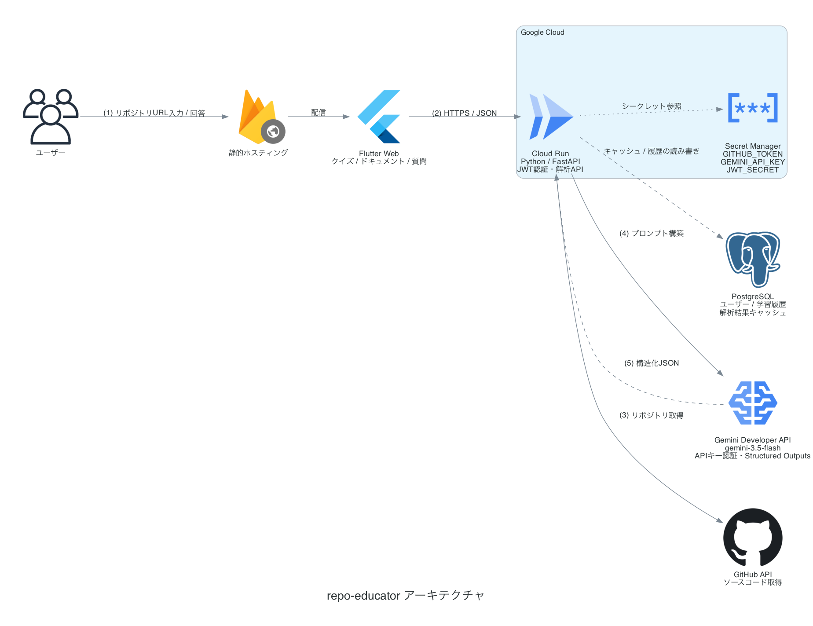
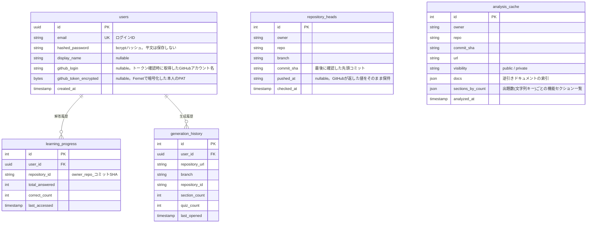

# GitHubリポジトリ自動解析・AI学習支援サービス


## 1. システム概要
本システムは、ユーザーが指定したGitHubリポジトリ（またはソースコード群）を自動で解析し、そのコードの重要な概念、アルゴリズム、アーキテクチャ、言語仕様に関する **「穴埋めクイズ」** と **「逆引きドキュメント」** を自動生成する学習支援プラットフォームである。

1回の解析から、目的の異なる2つの成果物を生成する。

| 成果物 | 目的 | 使う場面 |
|---|---|---|
| **穴埋めクイズ** | コードを読む力を鍛える | 腰を据えて理解を深めたいとき |
| **逆引きドキュメント** | 知りたいことに最短でたどり着く | 「この機能はどこ？」を今すぐ知りたいとき |

---

## 2. システムアーキテクチャ
システム全体の構成およびデータフローを以下に示す。

### 2.1 アーキテクチャ構成図



図の生成は [docs/architecture.py](docs/architecture.py)（`diagrams` + graphviz）。構成を変えたらこのスクリプトを実行して `docs/architecture.png` を更新する。

### 2.2 コンポーネントの役割
1. **Frontend (Flutter Web)**:
   * ユーザーインターフェースを提供。GitHubリポジトリのURL受付、クイズの出題（インタラクティブな穴埋めUI）、解答判定、スコア表示、学習履歴の可視化。
2. **Backend (Cloud Run - Python/FastAPI)**:
   * GitHub API等を利用して指定されたリポジトリの主要なソースコード（`.py`, `.js`, `.go`など）をダウンロード・結合。
   * Gemini Developer API 経由でGeminiモデルを呼び出し、構造化データ（JSON）としてクイズとドキュメントを取得・パース。
   * **クイズ生成とドキュメント生成は、取得済みソースを使い回して並行実行する**（`asyncio.gather`）。1回の呼び出しに両方を詰め込むと出力トークン上限でJSONが途中で切れやすいため、あえて別呼び出しにしている。
3. **認証・DB（FastAPI + JWT + PostgreSQL）**:
   * **認証**: メールアドレス + パスワード（bcryptでハッシュ化）。ログイン成功時にJWTを発行し、フロントエンドは `Authorization: Bearer <JWT>` として送る。
   * **DB（PostgreSQL）**: ユーザー、暗号化したGitHubトークン、学習履歴、解析結果キャッシュ、ブランチ更新確認用のポインタを保存。SQLAlchemy(async) + asyncpg 経由。ローカル開発はDocker Composeのpostgresコンテナ、本番はNeon等のマネージドPostgresを想定（接続文字列を差し替えるだけ）。
4. **AI Engine (Gemini)**:
   * 既定では `gemini-3.5-flash` を使用（環境変数 `GEMINI_MODEL` で差し替え可能）。Structured Outputs（スキーマ定義によるJSON強制出力）を利用し、アプリケーション側でパースしやすい形式でクイズとドキュメントを生成。
   * SDKは **`google-genai`**。接続処理は `backend/app/gemini.py` に集約している（後述）。
   * `genai.Client(api_key=...)` で ai.google.dev のGemini Developer APIを直接呼ぶ、APIキー1本の方式。DBや認証の設定とは完全に独立しており、それらが空でもGeminiだけは動く。

---

## 2.3 認証とリポジトリアクセス

本システムの**認証は任意**である。公開リポジトリの学習はログインなしで利用でき、ログインするとプライベートリポジトリの学習と学習履歴の保存が加わる。

「本人確認」と「リポジトリへのアクセス権」を意図的に分離している。

| | 担当 | 得られるもの |
|---|---|---|
| メールアドレス + パスワード認証（自前実装） | **本人確認** | ユーザーID、JWT |
| ユーザーが設定画面で入力する Personal Access Token | **リポジトリへのアクセス権** | 本人が発行したPAT |

本人確認はメールアドレス + パスワード認証（`backend/app/auth.py`）で行う。プライベートリポジトリへのアクセスは、これとは別にユーザー自身が GitHub で発行した PAT を、アプリの設定画面に直接入力する方式にしている。サーバ側の環境変数として焼き込むトークンとは別物で、**本人しか持たない**。

PATは**1ユーザーにつき複数登録できる**。fine-grained PAT は発行時に選んだリポジトリしか読めないため、複数の組織やアカウントにまたがると1本では足りないからである。どのトークンでどのリポジトリを読むかはサーバ側が総当たりで見つけ、成功した組み合わせを `repository_token_bindings` に記録して次回以降はそれを先に試す。ユーザーがGitHub側で権限を変更して失敗するようになったら、記録を捨てて総当たりからやり直す。

### 認証フロー

```
1. ユーザーが「ログイン」→ メールアドレス + パスワードで登録 or ログイン
   （POST /api/v1/auth/register または /api/v1/auth/login）
2. サーバがパスワードを検証し、JWT（有効期限30日、既定）を発行する
3. フロントエンドはJWTを shared_preferences（Webではlocalstorage）に保存し、
   以降 Authorization: Bearer <JWT> として送る。ブラウザを閉じても再ログイン不要
4. アカウントメニューの「GitHubトークン」からPersonal Access Tokenを入力
5. POST /api/v1/github/tokens が GitHub 側でトークンの有効性を確認したうえで、
   Fernetで暗号化してDBに保存する（複数登録可。GET / DELETE で一覧・削除）
6. 以降、ログインしていればクイズ生成時に、登録済みトークンのうち
   そのリポジトリを読めるものをサーバが自動で選んで使う
7. ログアウトしても保存したPATは残り、再ログイン時に再入力は不要
```

### パスワード・トークンの扱い

* **パスワード** … `bcrypt` でハッシュ化して保存する。平文はDBに一切残らない
* **JWT** … `PyJWT`（HS256）で署名する。署名鍵は環境変数 `JWT_SECRET`
* **サーバ共有の `GITHUB_TOKEN`**（環境変数） … 未ログインでの公開リポジトリ取得のみに使う。レートリミット緩和が目的で、個人のプライベートリポジトリへはアクセスできない
* **ユーザー個別のPAT** … `cryptography.fernet` による対称鍵暗号化（鍵は環境変数 `ENCRYPTION_KEY`）でDBに保存する。**平文では保存しない**（暗号化鍵が未設定の場合は保存自体をスキップする）
* いずれのトークンも**ログには出力しない**。GitHub APIのレスポンス本文をそのままクライアントへ返さない

## 2.4 冗長な処理の排除

同じリポジトリ・同じコミットに対する解析は何度やっても同じ結果になる。GitHub API のレートリミットと Gemini の料金はどちらも実際の制約になるため、**ユーザーをまたいで解析結果を共有する**。

### 3段構えのキャッシュ

| 層 | 効く範囲 | 目的 |
|---|---|---|
| プロセス内メモリ | 単一インスタンス | 最も速い。DB未設定でも効く |
| PostgreSQL | 全インスタンス・全ユーザー | インスタンスをまたいで共有する |
| single-flight | 同時実行中のリクエスト | 同じ生成が人数分走るのを防ぐ |

Cloud Run は複数インスタンスに分散するためメモリだけでは共有を保証できず、逆にDBだけだと毎回読み取りが発生する。両方を重ねている。

### 更新確認は段階的に、軽い問い合わせから

「リポジトリが更新されたときだけ作り直す」ために、**安い確認から順に行い、必要になるまで次に進まない**。

```
1. fetch_repository_meta()  … pushed_at と public/private（GitHub API 1回）
2. 前回と同じ pushed_at なら → 記録済みのコミットSHAを再利用（ここで確定）
3. 違えば resolve_commit_sha()  … 対象ブランチの先頭SHA（GitHub API 1回）
4. キャッシュ判定             … SHAが一致すればここで返す
5. fetch_repository_files() … ミスしたときだけ。ファイル数に比例してAPIを消費する
6. Gemini呼び出し            … single-flightで1本にまとめる
```

ファイルを取得してからキャッシュを見ると、ヒット時でも数十回のGitHub APIを浪費してしまう。**判定に必要な最小限の情報だけを先に取る**のがこの設計の要点である。

#### pushed_at を「再生成の判断」に使ってはいけない

`pushed_at` は**リポジトリ全体**の最終push時刻で、対象ブランチ固有ではない。別のブランチへのpushでも進む。

そのため次のように非対称に扱う。

| 判定 | 意味 | 動作 |
|---|---|---|
| `pushed_at` が前回と同じ | **確実に**変わっていない | コミットSHAの問い合わせを省く |
| `pushed_at` が進んだ | 変わった**かもしれない** | コミットSHAを確認する。同じなら再生成しない |

「進んでいたら再生成」にすると、無関係なブランチへのpushのたびに作り直してしまう。**再生成の判断は常にコミットSHAで行う。**

また、比較は**GitHubが返した `pushed_at` 同士**で行う（自前の解析時刻とは突き合わせない）。サーバー間の時計のずれで誤判定するのを避けるため。`pushed_at` が取れない場合や記録がない場合は、必ずSHAを確認する側に倒す。

#### 実測（GitHub API の消費回数）

| 状況 | meta | SHA照会 | ファイル取得 | AI生成 |
|---|---|---|---|---|
| 初回 | 1 | 1 | あり | あり |
| 変化なしで再訪問 | 1 | 0 | なし | なし |
| 別ブランチにpush（対象は不変） | 1 | 1 | なし | なし |
| 対象ブランチが進んだ | 1 | 1 | あり | あり |

ブランチ先頭のポインタは PostgreSQL の `repository_heads` テーブル（`owner`/`repo`/`branch` の複合ユニークキー）に保持する。解析結果キャッシュ（`analysis_cache` テーブル）とは別テーブルにして、軽い読み取りだけで済むようにしている。

### 出題数とドキュメントの分離

ドキュメントは出題数に依存しないが、クイズは依存する。そのため1つのキャッシュドキュメント内で、

* `docs` … 常に共有する
* `sections_by_count` … 出題数をキーに保持する

とし、「同じリポジトリを別の出題数で開いただけ」でドキュメントまで作り直すことがないようにしている。

なお、レスポンスの `repository_id` には出題数を含めない。これは学習履歴のキーでもあり、出題数ごとに進捗が分断されるのを避けるため。

### キャッシュとアクセス権

private リポジトリの解析結果は**ユーザーごとにキャッシュを分けず、返す直前に毎回アクセス権を確認する**（`_ensure_can_read`）。インストールを外された後もキャッシュが返り続ける事故を防ぐため。生成を待っている間に権限が変わる可能性があるので、生成完了後にも再確認する。

### ソースコード取得の方式

`raw.githubusercontent.com` は `Authorization` ヘッダを受け付けずプライベートリポジトリを読めないため、**GitHub API の Blobs API**（`GET /repos/{owner}/{repo}/git/blobs/{sha}` + `Accept: application/vnd.github.raw`）を使う。ツリー取得のレスポンスに各ファイルの SHA が含まれるため追加の照会は不要。

---

## 3. データモデル設計 (PostgreSQL)

SQLAlchemy(async) のモデル定義は `backend/app/db.py` を参照。マイグレーションツール（Alembic等）は導入せず、起動時に `create_all` でテーブルを作成する単純な構成にしている。



ユニーク制約と、各テーブルを置いている理由は次のとおり。

| テーブル | ユニーク制約 | 役割 |
|---|---|---|
| `users` | `email` | アカウントと、本人が入力したGitHubトークン |
| `learning_progress` | `(user_id, repository_id)` | ユーザー×リポジトリごとの解答履歴 |
| `generation_history` | `(user_id, repository_url, branch)` | 生成したクイズを開き直すための履歴。クイズの中身は持たない |
| `repository_heads` | `(owner, repo, branch)` | 「最後に確認した状態」。pushがない限りコミットSHAの問い合わせを省ける |
| `analysis_cache` | `(owner, repo, commit_sha)` | コミット単位のクイズ・ドキュメントのキャッシュ |

`repository_heads` と `analysis_cache` はユーザーに紐づかない。同じコミットの解析結果は誰が開いても同じなので、**利用者をまたいで共有する**（「2.4 冗長な処理の排除」参照）。ただしprivateリポジトリの結果を返す前には、毎回アクセス権を確認する。

`sections_by_count` の各要素（1件の機能セクション）のスキーマ:

```json
{
  "section_id": "string (UUID)",
  "title": "string (機能セクション名)",
  "description": "string (実務上どんな役割のコード群か)",
  "quizzes": [
    {
      "quiz_id": "string (UUID)",
      "file_path": "string (対象となったソースコードのパス)",
      "scenario": "string (実務でこのコードに触る場面)",
      "question_text": "string (穴埋め用のプレースホルダー [BLANK] を含むテキスト)",
      "code_snippet": "string (関連するコード断片。穴埋め箇所は ___ 表現)",
      "choices": ["string", "string", "string", "string"],
      "correct_answer": "string",
      "explanation": "string (なぜその答えになるのか、コードのどの部分に依存しているかの解説)"
    }
  ]
}
```

`docs` の各要素（1件の逆引きドキュメント）のスキーマ:

```json
{
  "doc_id": "string (UUID)",
  "kind": "string (feature | symbol | task | file)",
  "title": "string (検索でそのまま入力されうる語)",
  "summary": "string (1〜2文。検索結果一覧に表示する)",
  "body": "string (本文。段落は空行2つで区切る)",
  "file_paths": ["string"],
  "symbols": ["string (関連する関数名・クラス名)"],
  "tags": ["string (日本語・英語の別名を含む検索キーワード)"],
  "code_refs": [
    {
      "file_path": "string",
      "snippet": "string (穴埋めしない原文のコード)",
      "note": "string (その断片が何をしているかの1文)"
    }
  ],
  "related_section_titles": ["string (対応するクイズのセクション名)"]
}
```

行のキーはブランチ名ではなく**コミットSHA**を含める。ブランチが進んだときに古いクイズが返り続けるのを防ぐため。

`docs` は後から追加されたフィールドのため、**これを持たない古いキャッシュ行を読んでも壊れないよう、バックエンド・フロントエンドとも既定値を空リストにしている。**

**キャッシュのスコープ**: `visibility` が `private` の行は、**返却のたびに呼び出し元が現在有効なGitHubトークンを持つかを再確認**してから返す。ユーザーごとに行を分けるのではなく都度確認する方式にしているのは、設定画面からトークンを削除した後もキャッシュが返り続ける事故を防ぐため。

**DBへのアクセスはバックエンドのみが行う。** フロントエンドは接続情報を一切持たず、必ずAPI（`Authorization: Bearer <JWT>`）経由でやり取りする。これにより `github_token_encrypted` や `hashed_password` のような機微なカラムがクライアントに露出する経路は存在しない。

---

## 4. APIエンドポイント設計 (Cloud Run)

認証は `Authorization: Bearer <JWT>` で行う（JWTは `/api/v1/auth/register` または `/api/v1/auth/login` が発行する）。

| メソッド | パス | 認証 | 内容 |
|---|---|---|---|
| POST | `/api/v1/auth/register` | — | メールアドレス + パスワードで新規登録。JWTを返す |
| POST | `/api/v1/auth/login` | — | ログイン。JWTを返す |
| POST | `/api/v1/quiz/generate` | **任意** | クイズ生成。認証があれば保存済みトークンでプライベートリポジトリも対象になる |
| POST | `/api/v1/docs/ask` | **任意** | リポジトリについての質問に、実際のソースを根拠に回答する |
| GET | `/api/v1/me` | 必須 | アカウント情報とGitHubトークンの設定状況 |
| PUT | `/api/v1/github/token` | 必須 | Personal Access Tokenを検証したうえで暗号化保存 |
| DELETE | `/api/v1/github/token` | 必須 | 保存済みトークンを削除 |
| GET | `/api/v1/repositories` | 必須 | 保存済みトークンで読めるプライベートリポジトリ一覧 |
| GET | `/api/v1/history` | 必須 | 生成したクイズの履歴（新しい順） |
| DELETE | `/api/v1/history` | 必須 | 履歴を1件削除 |
| POST | `/api/v1/progress/answer` | 必須 | 1問回答するごとの記録 |
| GET | `/api/v1/progress` | 必須 | 学習履歴の取得 |

### 4.1 クイズ生成・取得API

* **Endpoint**: `/api/v1/quiz/generate`
* **Method**: `POST`
* **認証**: 任意。**Authorizationヘッダがなければ公開リポジトリのみを扱う**（未ログインでの学習を維持するため）
* **Request Body**:
```json
{
  "repository_url": "https://github.com/user/repo",
  "branch": "main",
  "num_questions": 5,
  "focus_language": "python" 
}

```


* **Response Body**: `analysis_cache` テーブルのスキーマに準拠したJSON。
* **エラー**: `400` URL形式不正 / `403` リポジトリを読む権限がない / `404` リポジトリまたはブランチが存在しない / `429` GitHub APIのレートリミット到達
* レスポンスの `cached` は、キャッシュから返したかどうかを示す（動作確認・運用時の切り分け用）

> **`403` と `429` の区別**: GitHubはレートリミットにも権限不足にも `403` を返す。両者を同じ扱いにすると、レートリミットなのに「権限がありません」と誤って案内してしまう。`x-ratelimit-remaining` ヘッダーを見て区別し、レートリミットは `429` と復帰までの目安時間で返している。未認証は60req/hしかないため実際に到達しうる。

---

## 5. AIプロンプト・エンジニアリング & スキーマ設計

Geminiへの入力プロンプトには、ソースコードの文字列とともに、以下の指示（システムインストラクション）を埋め込む。さらに、出力形式を厳密に制御するために **Structured Outputs (JSON Schema)** を定義する。

### 5.1 システムプロンプト（System Instruction）

```text
あなたは高度なソフトウェアエンジニアリングの教育者です。
提供されたソースコードを深く分析し、このコードの仕様、アルゴリズム、設計パターン、あるいは重要な文法を学習者が理解するための「4択の穴埋めクイズ」を生成してください。

【問題作成のルール】
1. 問題文には穴埋め対象として `[BLANK]` という文字列を含めてください。
2. 関連するコード断片（スニペット）がある場合は、該当箇所を `____` に置き換えて提示してください。
3. 選択肢（choices）は4つとし、うち1つだけが正解（correct_answer）となるようにしてください。
4. 解説（explanation）には、なぜその選択肢が正しいのか、コードの挙動や設計思想に基づいた詳細な説明を記述してください。

```

### 5.2 逆引きドキュメントの設計

ドキュメントは、**「何で引くか」の4つの粒度**で索引を作る。同じコードでも、探し方は人によって違うため。

| kind | 何で引くか | 例 |
|---|---|---|
| `feature` | 機能名 | 「認証」「リトライ処理」 |
| `symbol` | 関数・クラス名 | `Context.Next()`、`Session` |
| `task` | やりたいこと | 「新しいエンドポイントを追加するには」 |
| `file` | ファイル名 | `context.go` |

`task` はクイズの `scenario` フィールドと発想が同じ（実務でこのコードに触る場面から入る）で、プロンプトで語彙を揃えている。

**`tags` が検索のヒット率を左右する最重要フィールドである。** 日本語と英語の両方の呼び名・略称・関連語を入れさせている（例: 認証なら `["認証", "ログイン", "サインイン", "auth", "authentication", "login"]`）。これにより「ログイン」と入力しても「認証」のエントリにたどり着ける。

#### 検索の実行場所

**検索はフロントエンド側のインメモリ処理で完結し、サーバー往復は発生しない。** 解析結果と一緒に受け取ったJSONに対して、キー入力のたびに絞り込む。

日本語は空白で分かち書きされないため、形態素解析は行わず**小文字化した部分一致**を基本とする。英数字のみのクエリに限り、追加で空白区切りのトークン一致も見る（「context next」で `Context.Next()` を引けるようにするため）。

スコアリングは `frontend/lib/docs/doc_search.dart` を参照。タイトル完全一致 > 識別子一致 > タイトル部分一致 > タグ > 概要 > 本文 の順に重み付けしている。

### 5.3 出力スキーマ

Structured Outputs で強制する出力スキーマは、`quizzes` を要素とする配列とし、各要素は `file_path` / `question_text` / `code_snippet` / `choices` / `correct_answer` / `explanation` を持つ（`code_snippet` を除く5項目を必須とする）。各項目の意味は「3.1 `repositories` コレクション」のスキーマに準拠する。

実装は `backend/app/quiz_generator.py` を参照。

### 5.4 SDKと接続方式

**SDKは `google-genai`、接続は Gemini Developer API（APIキー1本）。**

```python
genai.Client(api_key=settings.gemini_api_key)
```

PostgreSQL や JWT はログイン機能のためだけに使っており、**AIの利用自体はそれらと切り離せる**。`GEMINI_API_KEY` さえあれば、DBもGCPプロジェクトもなしでクイズ・ドキュメント生成が動く（ログイン機能を使わないなら `DATABASE_URL` / `JWT_SECRET` は一切不要）。

接続処理は `backend/app/gemini.py` の `generate_json()` に集約している。クイズ生成とドキュメント生成の両方がここを経由するため、SDKや接続方式の差し替えはこの1ファイルで完結する。

呼び出しは同期版ではなく `client.aio.models.generate_content` を使う。クイズとドキュメントを `asyncio.gather` で並行実行するため、イベントループを塞いではいけない。

#### モデルIDは環境変数で差し替える

Geminiのモデルは定期的に廃止される。実際に次のことが起きている。

| 世代 | 状況 |
|---|---|
| Gemini 1.5 系 | **廃止済み**（404を返す） |
| Gemini 2.5 系 | 2026年10月16日に廃止予定 |
| Gemini 3.x 系 | 現行 |

そのためモデルIDをコードに直書きせず、環境変数 `GEMINI_MODEL` で指定する（未設定時は `gemini-3.5-flash`）。**次の廃止時に必要なのは設定変更だけで、コード変更もデプロイ内容の見直しも要らない。**

---

## 6. セキュリティ・運用要件

1. **GitHub APIのレートリミット対策**:
* 公開リポジトリであっても、大量のアクセスに対応するため、Cloud Run側にGitHubの「Personal Access Token」をSecret Manager経由で環境変数として埋め込み、認証付きリクエストを行う。


2. **コスト管理**:
* 「2.4 冗長な処理の排除」を参照。同一リポジトリ・同一コミットへのリクエストは、ユーザーをまたいで解析結果を共有する。


3. **Geminiの認証情報の扱い**:
* `GEMINI_API_KEY` は他のシークレットと同様、環境変数へ直書きせず Secret Manager 経由で Cloud Run に注入する。GCPのIAMロールとは無関係で、AI用の権限付与は不要。


4. **認証情報の管理**（ログイン機能を使う場合）:
* `DATABASE_URL` / `JWT_SECRET` / `ENCRYPTION_KEY` は他のシークレットと同様、環境変数へ直書きせず Secret Manager 等の秘密管理サービス経由で注入する。GCP固有の権限は不要。
* `JWT_SECRET` は複数インスタンスで同じ値を共有する必要がある（インスタンスごとに異なると、あるインスタンスで発行したJWTが他のインスタンスで検証できない）。


5. **ユーザーのGitHubトークンの扱い**:
* ユーザーが入力するPersonal Access Tokenは、サーバの環境変数には一切保存しない。設定画面から個別に入力させ、GitHub側で有効性を確認したうえで `cryptography.fernet` で暗号化してDBに保存する。
* 権限は読み取り専用（classicなら `repo`、fine-grainedなら対象リポジトリの `Contents: Read-only`）で発行するようUIで案内する。
* ユーザーは設定画面からいつでもトークンを削除できる。


6. **プライベートコードの取り扱い**:
* プライベートリポジトリのソースコードは、クイズ・ドキュメント生成のため Gemini（Gemini Developer API）に送信される。リポジトリ選択画面でこの旨をユーザーに明示している。
* **ドキュメントはクイズと違い、コードを穴埋めせず原文のまま引用する。** そのためキャッシュのアクセス権再確認（`visibility: private` の都度確認）はクイズ以上に重要であり、この判定を緩めてはならない。


7. **CORS**:
* 許可オリジンは `FRONTEND_ORIGIN` で指定する。未指定時は開発用に全許可（`*`）となるため、**本番では必ずフロントエンドの配信ドメインを設定する**。


## 7. 今後の展望：GitHubアカウントでのサインイン（SSO）

現在の構成は「メールアドレス + パスワードで本人確認」「PATでリポジトリのアクセス権」という二段構えである（「2.3 認証とリポジトリアクセス」）。ここを **GitHub App によるサインイン**に置き換えることを次の一歩として想定している。

### 何が解決されるか

| 現在の課題 | SSO導入後 |
|---|---|
| PATの発行手順が最大の離脱点。取得手順の説明モーダルを用意しなければ使い始められない | 「GitHubでサインイン」の1クリック。発行手順そのものが消える |
| fine-grained PAT は選んだリポジトリしか読めず、複数登録・総当たり・バインディング記録という仕組みが必要 | インストール時にユーザーがリポジトリを選ぶ。どのトークンを使うかという問題自体がなくなる |
| PATを暗号化してDBに長期保管する（失効はユーザー任せ） | 短命のアクセストークン + リフレッシュトークン。ユーザーがGitHub側でアプリを削除すれば即座に失効する |
| パスワードのハッシュ・リセット・使い回しリスクを自前で抱える | 認証情報を保持しない。パスワードリセット導線が不要になる |
| 組織が **SAML SSO** を強制している場合、PATは個別に「Configure SSO」で認可しないと使えず、手順がさらに増える | 組織管理者が一度インストールすれば、所属メンバーは追加の認可作業なしに使える |
| ユーザーの表示名がメールアドレスしかない | アバター・GitHubログイン名をそのまま使える |

加えて、GitHub App では **Webhook** を受け取れる。push を契機にキャッシュを事前に温めておけば、「クイズを始める」を押した時点ですでに生成が終わっている状態を作れる。

> **用語の注意**: GitHub まわりの「SSO」は二つの意味で使われる。ここで導入対象とするのは (a) *Sign in with GitHub*（OAuth によるサインイン）である。(b) 組織が強制する *SAML SSO* は GitHub 側の機能で、こちらは (a) を入れることで対処が楽になる、という関係にある。

### OAuth App ではなく GitHub App を選ぶ理由

OAuth App の `repo` スコープは**全プライベートリポジトリへの読み書き**という粗い粒度しかない。学習のために読むだけのアプリが書き込み権限まで要求するのは過剰である。GitHub App ならインストール単位でリポジトリを選べ、権限も `Contents: Read-only` まで絞れる。これは現在PATの発行案内で求めている権限（「6. セキュリティ・運用要件」5項）と同じ粒度であり、方針を変えずに移行できる。

### 実装の見通し

* **DB** … `users` に `github_user_id` / `github_login` / `avatar_url` を追加。`password_hash` は NULL 許容にして、既存のメール認証ユーザーと併存させる。`github_tokens` は GitHub App のインストールトークンを持つ形に寄せていく
* **バックエンド** … `/api/v1/auth/github/start` と `/api/v1/auth/github/callback` を追加。`state` を CSRF 対策として保持し、コールバックで受け取ったコードをアクセストークンに交換して、既存と同じ JWT を発行する。**JWT を発行する部分から先は現在の実装がそのまま使える**
* **シークレット** … `GITHUB_APP_ID` / `GITHUB_CLIENT_ID` / `GITHUB_CLIENT_SECRET` / `GITHUB_APP_PRIVATE_KEY` を Secret Manager に追加する
* **フロントエンド** … ログインダイアログに「GitHubでサインイン」を追加。PAT入力欄は当面残す（GitHub App を組織にインストールできない立場のユーザーがいるため）

### 移行の考え方

既存のメール/パスワードのユーザーを壊さないため、**両方の認証手段を併存させる**。同一メールアドレスで GitHub サインインしたときにアカウントを自動で結合するかどうかは、なりすましのリスクがあるため慎重に決める必要がある（GitHub 側でメールが検証済みかを確認したうえで、明示的な結合操作を求めるのが安全）。
